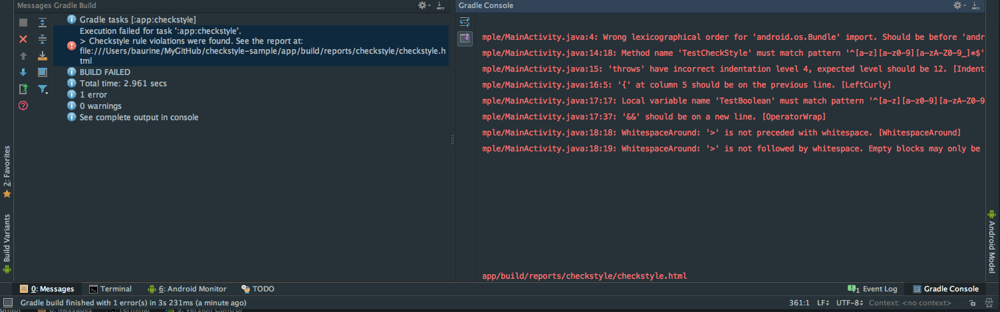

# Checkstyle Sample

Tutorial and sample showing how to use the [checkstyle](http://checkstyle.sourceforge.net/) tool to check the code style of Android projects in Android Studio.

## Tutorial

1. [Using checkstyle in Android Studio](./note/checkstyle-sample-note.md)

## Screenshot

