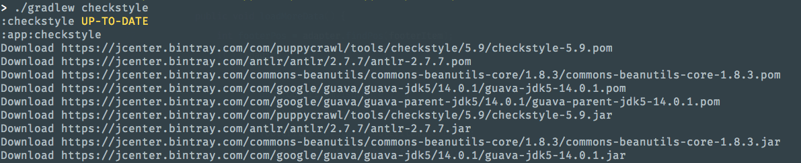
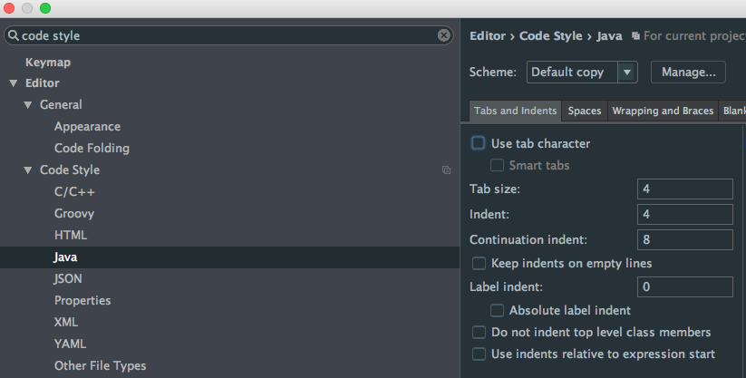

# Using checkstyle in Android Studio

[Checkstyle](http://checkstyle.sourceforge.net/) is a tool to help you check your Java code (only Java) style. We want to use it to help us to check the Android project code style before run and commit to git. It has many plugins for different IDE and build tool, here we use its gradle plugin.

## References

### Chinese
1. [Android代码规范利器：Checkstyle](http://droidyue.com/blog/2016/05/22/use-checkstyle-for-better-code-style/index.html)

### English
1. [How to improve quality and syntax of your Android code](http://vincentbrison.com/2014/07/19/how-to-improve-quality-and-syntax-of-your-android-code/)
1. [Using the Gradle Checkstyle Plugin for Code Style Reporting](https://www.youtube.com/watch?v=zo3zyyo7Vkw)

## Steps

### Step 1 - Apply Plugin

Apply the checkstyle plugin in project's `build.gradle`:

    allprojects {
        repositories {
            jcenter()
        }
        apply plugin: 'checkstyle'
        checkstyle {
            // assign the latest checkstyle version explicitly
            // default version is very old, likes 5.9
            toolVersion = '7.4'
        }
        task checkstyle(type: Checkstyle) {
            // rules.xml copy from:
            // https://raw.githubusercontent.com/checkstyle/checkstyle/checkstyle-7.4/src/main/resources/google_checks.xml
            // the version should be as same as plugin version
            configFile new File(rootDir, "config/checkstyle/rules.xml")
            source 'src'
            include '**/*.java'
            exclude '**/gen/**'
            exclude '**/R.java'
            exclude '**/BuildConfig.java'
            classpath = files()
        }
    }

1. It's better to assign the checkstyle version explicitly using `checkstyle` method, otherwise it will use an old version (5.9 at time of writing) as opposed to the latest one (7.4 at time of writing).
1. Copy the corresponding code style rules from checkstyle repo in github (`google_checks.xml`), and put it in the project folder (`config/checkstyle/rules.xml`).
1. Define a task called `checkstyle`.
1. Configure the `rules.xml` path.
1. Set which files need to be checked and which don't (auto-generated files).

Default plugin checkstyle version:

Now you can check syntax in console using the `./gradlew checkstyle` command:

    > ./gradlew checkstyle
    Incremental java compilation is an incubating feature.
    :checkstyle UP-TO-DATE
    :app:checkstyle
    Download https://jcenter.bintray.com/com/puppycrawl/tools/checkstyle/7.4/checkstyle-7.4.pom
    Download https://jcenter.bintray.com/org/antlr/antlr4-runtime/4.5.3/antlr4-runtime-4.5.3.pom
    Download https://jcenter.bintray.com/commons-beanutils/commons-beanutils/1.9.3/commons-beanutils-1.9.3.pom
    Download https://jcenter.bintray.com/org/apache/commons/commons-parent/41/commons-parent-41.pom
    Download https://jcenter.bintray.com/org/apache/apache/18/apache-18.pom
    Download https://jcenter.bintray.com/commons-collections/commons-collections/3.2.2/commons-collections-3.2.2.pom
    Download https://jcenter.bintray.com/org/apache/commons/commons-parent/39/commons-parent-39.pom
    Download https://jcenter.bintray.com/com/puppycrawl/tools/checkstyle/7.4/checkstyle-7.4.jar
    Download https://jcenter.bintray.com/org/antlr/antlr4-runtime/4.5.3/antlr4-runtime-4.5.3.jar
    Download https://jcenter.bintray.com/commons-beanutils/commons-beanutils/1.9.3/commons-beanutils-1.9.3.jar
    Download https://jcenter.bintray.com/commons-collections/commons-collections/3.2.2/commons-collections-3.2.2.jar
    [ant:checkstyle] [WARN] /Users/baurine/MyGitHub/checkstyle-sample/app/src/androidTest/java/com/baurine/checkstylesample/ExampleInstrumentedTest.java:10: Import statement for 'org.junit.Assert.*' is in the wrong order. Should be in the 'STATIC' group, expecting not assigned imports on this line. [CustomImportOrder]
    [ant:checkstyle] [WARN] /Users/baurine/MyGitHub/checkstyle-sample/app/src/androidTest/java/com/baurine/checkstylesample/ExampleInstrumentedTest.java:10: Using the '.*' form of import should be avoided - org.junit.Assert.*. [AvoidStarImport]
    [ant:checkstyle] [WARN] /Users/baurine/MyGitHub/checkstyle-sample/app/src/androidTest/java/com/baurine/checkstylesample/ExampleInstrumentedTest.java:19: 'method def modifier' have incorrect indentation level 4, expected level should be 2. [Indentation]
    [ant:checkstyle] [WARN] /Users/baurine/MyGitHub/checkstyle-sample/app/src/androidTest/java/com/baurine/checkstylesample/ExampleInstrumentedTest.java:22: 'method def' child have incorrect indentation level 8, expected level should be 4. [Indentation]
    [ant:checkstyle] [WARN] /Users/baurine/MyGitHub/checkstyle-sample/app/src/androidTest/java/com/baurine/checkstylesample/ExampleInstrumentedTest.java:24: 'method def' child have incorrect indentation level 8, expected level should be 4. [Indentation]
    [ant:checkstyle] [WARN] /Users/baurine/MyGitHub/checkstyle-sample/app/src/androidTest/java/com/baurine/checkstylesample/ExampleInstrumentedTest.java:25: 'method def rcurly' have incorrect indentation level 4, expected level should be 2. [Indentation]
    [ant:checkstyle] [WARN] /Users/baurine/MyGitHub/checkstyle-sample/app/src/main/java/com/baurine/checkstylesample/MainActivity.java:4: Wrong lexicographical order for 'android.os.Bundle' import. Should be before 'android.support.v7.app.AppCompatActivity'. [CustomImportOrder]
    [ant:checkstyle] [WARN] /Users/baurine/MyGitHub/checkstyle-sample/app/src/main/java/com/baurine/checkstylesample/MainActivity.java:8: 'method def modifier' have incorrect indentation level 4, expected level should be 2. [Indentation]
    [ant:checkstyle] [WARN] /Users/baurine/MyGitHub/checkstyle-sample/app/src/main/java/com/baurine/checkstylesample/MainActivity.java:10: 'method def' child have incorrect indentation level 8, expected level should be 4. [Indentation]
    [ant:checkstyle] [WARN] /Users/baurine/MyGitHub/checkstyle-sample/app/src/main/java/com/baurine/checkstylesample/MainActivity.java:11: 'method def' child have incorrect indentation level 8, expected level should be 4. [Indentation]
    [ant:checkstyle] [WARN] /Users/baurine/MyGitHub/checkstyle-sample/app/src/main/java/com/baurine/checkstylesample/MainActivity.java:12: 'method def rcurly' have incorrect indentation level 4, expected level should be 2. [Indentation]
    [ant:checkstyle] [WARN] /Users/baurine/MyGitHub/checkstyle-sample/app/src/test/java/com/baurine/checkstylesample/ExampleUnitTest.java:5: Import statement for 'org.junit.Assert.*' is in the wrong order. Should be in the 'STATIC' group, expecting not assigned imports on this line. [CustomImportOrder]
    [ant:checkstyle] [WARN] /Users/baurine/MyGitHub/checkstyle-sample/app/src/test/java/com/baurine/checkstylesample/ExampleUnitTest.java:5: Using the '.*' form of import should be avoided - org.junit.Assert.*. [AvoidStarImport]
    [ant:checkstyle] [WARN] /Users/baurine/MyGitHub/checkstyle-sample/app/src/test/java/com/baurine/checkstylesample/ExampleUnitTest.java:13: 'method def modifier' have incorrect indentation level 4, expected level should be 2. [Indentation]
    [ant:checkstyle] [WARN] /Users/baurine/MyGitHub/checkstyle-sample/app/src/test/java/com/baurine/checkstylesample/ExampleUnitTest.java:15: 'method def' child have incorrect indentation level 8, expected level should be 4. [Indentation]
    [ant:checkstyle] [WARN] /Users/baurine/MyGitHub/checkstyle-sample/app/src/test/java/com/baurine/checkstylesample/ExampleUnitTest.java:16: 'method def rcurly' have incorrect indentation level 4, expected level should be 2. [Indentation]

    BUILD SUCCESSFUL

    Total time: 34.944 secs

So many warnings!

### Step 2 - Modify Severity

Although there are so many warnings, the project still builds successfully but that's not exactly what we want. We want the build to fail if the code style check doesn't pass. So we comment the `warning` level `severity` property in `rules.xml`.

    <!--<property name="severity" value="warning"/>-->

Run `./gradlew checkstyle` again and now it fails:

    > ./gradlew checkstyle
    Incremental java compilation is an incubating feature.
    :checkstyle UP-TO-DATE
    :app:checkstyle
    ...
    [ant:checkstyle] [ERROR] /Users/baurine/MyGitHub/checkstyle-sample/app/src/test/java/com/baurine/checkstylesample/ExampleUnitTest.java:16: 'method def rcurly' have incorrect indentation level 4, expected level should be 2. [Indentation]
    :app:checkstyle FAILED

    FAILURE: Build failed with an exception.

    * What went wrong:
    Execution failed for task ':app:checkstyle'.
    > Checkstyle rule violations were found. See the report at: file:///Users/baurine/MyGitHub/checkstyle-sample/app/build/reports/checkstyle/checkstyle.html

    * Try:
    Run with --stacktrace option to get the stack trace. Run with --info or --debug option to get more log output.

    BUILD FAILED

### Step 3 - Modify Indentation Rule

There are many errors about 'Indentation' (it should be '2' or '4', not '4' or '8'). The default indentation in Android Studio is '4' or '8' and we should use this configuration.

You can see the default code style in Android Studio in Preferences

Modify the 'Indentation' rule in `rules.xml` by changing `2` to `4`, and `4` to `8`:

        <module name="Indentation">
            <property name="basicOffset" value="4"/>
            <property name="braceAdjustment" value="0"/>
            <property name="caseIndent" value="4"/>
            <property name="throwsIndent" value="8"/>
            <property name="lineWrappingIndentation" value="8"/>
            <property name="arrayInitIndent" value="4"/>
        </module>

Then run `./gradlew checkstyle` again and 'Indentation' error have disppeared:

    > ./gradlew checkstyle
    Incremental java compilation is an incubating feature.
    :checkstyle UP-TO-DATE
    :app:checkstyle
    [ant:checkstyle] [ERROR] /Users/baurine/MyGitHub/checkstyle-sample/app/src/androidTest/java/com/baurine/checkstylesample/ExampleInstrumentedTest.java:10: Import statement for 'org.junit.Assert.*' is in the wrong order. Should be in the 'STATIC' group, expecting not assigned imports on this line. [CustomImportOrder]
    [ant:checkstyle] [ERROR] /Users/baurine/MyGitHub/checkstyle-sample/app/src/androidTest/java/com/baurine/checkstylesample/ExampleInstrumentedTest.java:10: Using the '.*' form of import should be avoided - org.junit.Assert.*. [AvoidStarImport]
    [ant:checkstyle] [ERROR] /Users/baurine/MyGitHub/checkstyle-sample/app/src/main/java/com/baurine/checkstylesample/MainActivity.java:4: Wrong lexicographical order for 'android.os.Bundle' import. Should be before 'android.support.v7.app.AppCompatActivity'. [CustomImportOrder]
    [ant:checkstyle] [ERROR] /Users/baurine/MyGitHub/checkstyle-sample/app/src/test/java/com/baurine/checkstylesample/ExampleUnitTest.java:5: Import statement for 'org.junit.Assert.*' is in the wrong order. Should be in the 'STATIC' group, expecting not assigned imports on this line. [CustomImportOrder]
    [ant:checkstyle] [ERROR] /Users/baurine/MyGitHub/checkstyle-sample/app/src/test/java/com/baurine/checkstylesample/ExampleUnitTest.java:5: Using the '.*' form of import should be avoided - org.junit.Assert.*. [AvoidStarImport]
    :app:checkstyle FAILED

    FAILURE: Build failed with an exception.

### Step 4 - Config Suppression

The are still has some errors coming from auto-generated files but these files don't need to be checked for code style so tell checkstyle not to check these files. We already used the `exclude` grammar, but `suppressions` can control more details. Create `suppressions.xml` in `config/checkstyle` folder (copied from [vincentbrison/vb-android-app-quality](https://github.com/vincentbrison/vb-android-app-quality)):

    <?xml version="1.0"?>
    <!DOCTYPE suppressions PUBLIC
        "-//Puppy Crawl//DTD Suppressions 1.1//EN"
        "http://www.puppycrawl.com/dtds/suppressions_1_1.dtd">
    <suppressions>
        <suppress checks="[a-zA-Z0-9]*" files="Test" />
        <suppress checks="[a-zA-Z0-9]*" files="Dagger*" />
        <suppress checks="[a-zA-Z0-9]*" files=".*_.*Factory.java" />
        <suppress checks="[a-zA-Z0-9]*" files=".*ViewInjector.java" />
        <suppress checks="[a-zA-Z0-9]*" files=".*_MembersInjector.java" />
    </suppressions>

And modify `build.gradle` to define a varaible to save the `suppressions.xml` path.  Its value will be used in `rules.xml`:

    task checkstyle(type: Checkstyle) {
        configFile new File(rootDir, "config/checkstyle/rules.xml")
        configProperties.checkstyleSuppressionPath =
                new File(rootDir, "config/checkstyle/suppressions.xml").absolutePath
        ...
    }

Then use `checkstyleSuppressionPath` in `rules.xml` so `rules.xml` can know where to find the `SuppressionFilter`:

    <property name="fileExtensions" value="java, properties, xml"/>

    <module name="SuppressionFilter">
        <property name="file" value="${checkstyleSuppressionPath}"/>
    </module>

Run `./gradlew checkstyle` again and the auto-generated files are now ignored:

    > ./gradlew checkstyle
    Incremental java compilation is an incubating feature.
    :checkstyle UP-TO-DATE
    :app:checkstyle
    [ant:checkstyle] [ERROR] /Users/baurine/MyGitHub/checkstyle-sample/app/src/main/java/com/baurine/checkstylesample/MainActivity.java:4: Wrong lexicographical order for 'android.os.Bundle' import. Should be before 'android.support.v7.app.AppCompatActivity'. [CustomImportOrder]
    :app:checkstyle FAILED

    FAILURE: Build failed with an exception.

Check that it's working by writing some poorly styled code:

    private void TestCheckStyle()
    throws RuntimeException
    {
        boolean TestBoolean = 5 > 6 &&
                4>5;
        int ret = 5 / 0;
    }

    > ./gradlew checkstyle
    Incremental java compilation is an incubating feature.
    :checkstyle UP-TO-DATE
    :app:checkstyle
    [ant:checkstyle] [ERROR] /Users/baurine/MyGitHub/checkstyle-sample/app/src/main/java/com/baurine/checkstylesample/MainActivity.java:4: Wrong lexicographical order for 'android.os.Bundle' import. Should be before 'android.support.v7.app.AppCompatActivity'. [CustomImportOrder]
    [ant:checkstyle] [ERROR] /Users/baurine/MyGitHub/checkstyle-sample/app/src/main/java/com/baurine/checkstylesample/MainActivity.java:14:18: Method name 'TestCheckStyle' must match pattern '^[a-z][a-z0-9][a-zA-Z0-9_]*$'. [MethodName]
    [ant:checkstyle] [ERROR] /Users/baurine/MyGitHub/checkstyle-sample/app/src/main/java/com/baurine/checkstylesample/MainActivity.java:15: 'throws' have incorrect indentation level 4, expected level should be 12. [Indentation]
    [ant:checkstyle] [ERROR] /Users/baurine/MyGitHub/checkstyle-sample/app/src/main/java/com/baurine/checkstylesample/MainActivity.java:16:5: '{' at column 5 should be on the previous line. [LeftCurly]
    [ant:checkstyle] [ERROR] /Users/baurine/MyGitHub/checkstyle-sample/app/src/main/java/com/baurine/checkstylesample/MainActivity.java:17:17: Local variable name 'TestBoolean' must match pattern '^[a-z][a-z0-9][a-zA-Z0-9]*$'. [LocalVariableName]
    [ant:checkstyle] [ERROR] /Users/baurine/MyGitHub/checkstyle-sample/app/src/main/java/com/baurine/checkstylesample/MainActivity.java:17:37: '&&' should be on a new line. [OperatorWrap]
    [ant:checkstyle] [ERROR] /Users/baurine/MyGitHub/checkstyle-sample/app/src/main/java/com/baurine/checkstylesample/MainActivity.java:18:18: WhitespaceAround: '>' is not preceded with whitespace. [WhitespaceAround]
    [ant:checkstyle] [ERROR] /Users/baurine/MyGitHub/checkstyle-sample/app/src/main/java/com/baurine/checkstylesample/MainActivity.java:18:19: WhitespaceAround: '>' is not followed by whitespace. Empty blocks may only be represented as {} when not part of a multi-block statement (4.1.3) [WhitespaceAround]
    :app:checkstyle FAILED

    FAILURE: Build failed with an exception.

### Step 5 - Check before Commit

In order to prevent poorly styled code from going into Git you can use a 'pre-commit' hook.

Here is a sample 'pre-commit' hook that will check the style before code goes into git:

    # origin code
    if git rev-parse --verify HEAD >/dev/null 2>&1
    then
            against=HEAD
    else
            # Initial commit: diff against an empty tree object
            against=4b825dc642cb6eb9a060e54bf8d69288fbee4904
    fi

    # checkstyle
    SCRIPT_DIR=$(dirname "$0")
    SCRIPT_ABS_PATH=`cd "$SCRIPT_DIR"; pwd`
    $SCRIPT_ABS_PATH/../../gradlew checkstyle
    if [ $? -eq 0   ]; then
        echo "checkstyle OK"
    else
        exit 1
    fi

Then if you want to commit some poorly styled code, it will fail:

    > git commit -a -m 'test to commit the bad style code'
    Incremental java compilation is an incubating feature.
    :checkstyle UP-TO-DATE
    :app:checkstyle
    [ant:checkstyle] [ERROR] /Users/baurine/MyGitHub/checkstyle-sample/app/src/main/java/com/baurine/checkstylesample/MainActivity.java:4: Wrong lexicographical order for 'android.os.Bundle' import. Should be before 'android.support.v7.app.AppCompatActivity'. [CustomImportOrder]
    [ant:checkstyle] [ERROR] /Users/baurine/MyGitHub/checkstyle-sample/app/src/main/java/com/baurine/checkstylesample/MainActivity.java:14:18: Method name 'TestCheckStyle' must match pattern '^[a-z][a-z0-9][a-zA-Z0-9_]*$'. [MethodName]
    [ant:checkstyle] [ERROR] /Users/baurine/MyGitHub/checkstyle-sample/app/src/main/java/com/baurine/checkstylesample/MainActivity.java:15: 'throws' have incorrect indentation level 4, expected level should be 12. [Indentation]
    [ant:checkstyle] [ERROR] /Users/baurine/MyGitHub/checkstyle-sample/app/src/main/java/com/baurine/checkstylesample/MainActivity.java:16:5: '{' at column 5 should be on the previous line. [LeftCurly]
    [ant:checkstyle] [ERROR] /Users/baurine/MyGitHub/checkstyle-sample/app/src/main/java/com/baurine/checkstylesample/MainActivity.java:17:17: Local variable name 'TestBoolean' must match pattern '^[a-z][a-z0-9][a-zA-Z0-9]*$'. [LocalVariableName]
    [ant:checkstyle] [ERROR] /Users/baurine/MyGitHub/checkstyle-sample/app/src/main/java/com/baurine/checkstylesample/MainActivity.java:17:37: '&&' should be on a new line. [OperatorWrap]
    [ant:checkstyle] [ERROR] /Users/baurine/MyGitHub/checkstyle-sample/app/src/main/java/com/baurine/checkstylesample/MainActivity.java:18:18: WhitespaceAround: '>' is not preceded with whitespace. [WhitespaceAround]
    [ant:checkstyle] [ERROR] /Users/baurine/MyGitHub/checkstyle-sample/app/src/main/java/com/baurine/checkstylesample/MainActivity.java:18:19: WhitespaceAround: '>' is not followed by whitespace. Empty blocks may only be represented as {} when not part of a multi-block statement (4.1.3) [WhitespaceAround]
    :app:checkstyle FAILED

    FAILURE: Build failed with an exception.

Fix it:

    > git commit -a -m 'fix the bad code style'
    Incremental java compilation is an incubating feature.
    :checkstyle UP-TO-DATE
    :app:checkstyle

    BUILD SUCCESSFUL

    Total time: 2.207 secs
    checkstyle OK
    [master 5cc5f3b] fix the bad code style
    1 file changed, 5 insertions(+), 6 deletions(-)

That's all. You can continue to modify the rules in `rules.xml` to adjust to your needs.
