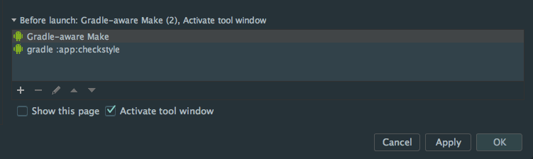

# Using checkstyle in Android Studio

[Checkstyle](http://checkstyle.sourceforge.net/) is a tool to help you check your Java code (just Java) style. We want to use it to help us to check the Android project code style before run and commit to git. It has many plugins for different IDE and build tool, here we use its gradle plugin.

## Reference

1. [Android代码规范利器： Checkstyle](http://droidyue.com/blog/2016/05/22/use-checkstyle-for-better-code-style/index.html)
1. [How to improve quality and syntax of your Android code](http://vincentbrison.com/2014/07/19/how-to-improve-quality-and-syntax-of-your-android-code/)
1. [Using the Gradle Checkstyle Plugin for Code Style Reporting](https://www.youtube.com/watch?v=zo3zyyo7Vkw)

## Steps

### Step 1 - Apply Plugin

At first, we apply the checkstyle plugin in project's `build.gradle`:

    allprojects {
        repositories {
            jcenter()
        }
        apply plugin: 'checkstyle'
        checkstyle {
            // assign the latest checkstyle version explicitly
            // default version is very old, likes 5.9
            toolVersion = '7.4'
        }
        task checkstyle(type: Checkstyle) {
            // rules.xml copy from:
            // https://raw.githubusercontent.com/checkstyle/checkstyle/checkstyle-7.4/src/main/resources/google_checks.xml
            // the version should be as same as plugin version
            configFile new File(rootDir, "config/checkstyle/rules.xml")
            source 'src'
            include '**/*.java'
            exclude '**/gen/**'
            exclude '**/R.java'
            exclude '**/BuildConfig.java'
            classpath = files()
        }
    }

- notice, we'd better to assign the checkstyle version explicitly by `checkstyle` method, else it will use the default version, and default version is very old, when I test, it is 5.9, and latest version is 7.4.
- then, we copy the corresponding code style rules from checkstyle repo in github, we follow google style, so we copy `google_checks.xml`, and put it in our project folder, likes `config/checkstyle/rules.xml`.
- we define a task called `checkstyle`, config the `rules.xml` path, files need to check, files don't need to check, especially the auto-generated files.

default plugin checkstyle version:

then, we can use `./gradlew checkstyle` command in console to execute this task for code style check:

    > ./gradlew checkstyle
    Incremental java compilation is an incubating feature.
    :checkstyle UP-TO-DATE
    :app:checkstyle
    Download https://jcenter.bintray.com/com/puppycrawl/tools/checkstyle/7.4/checkstyle-7.4.pom
    Download https://jcenter.bintray.com/org/antlr/antlr4-runtime/4.5.3/antlr4-runtime-4.5.3.pom
    Download https://jcenter.bintray.com/commons-beanutils/commons-beanutils/1.9.3/commons-beanutils-1.9.3.pom
    Download https://jcenter.bintray.com/org/apache/commons/commons-parent/41/commons-parent-41.pom
    Download https://jcenter.bintray.com/org/apache/apache/18/apache-18.pom
    Download https://jcenter.bintray.com/commons-collections/commons-collections/3.2.2/commons-collections-3.2.2.pom
    Download https://jcenter.bintray.com/org/apache/commons/commons-parent/39/commons-parent-39.pom
    Download https://jcenter.bintray.com/com/puppycrawl/tools/checkstyle/7.4/checkstyle-7.4.jar
    Download https://jcenter.bintray.com/org/antlr/antlr4-runtime/4.5.3/antlr4-runtime-4.5.3.jar
    Download https://jcenter.bintray.com/commons-beanutils/commons-beanutils/1.9.3/commons-beanutils-1.9.3.jar
    Download https://jcenter.bintray.com/commons-collections/commons-collections/3.2.2/commons-collections-3.2.2.jar
    [ant:checkstyle] [WARN] /Users/baurine/MyGitHub/checkstyle-sample/app/src/androidTest/java/com/baurine/checkstylesample/ExampleInstrumentedTest.java:10: Import statement for 'org.junit.Assert.*' is in the wrong order. Should be in the 'STATIC' group, expecting not assigned imports on this line. [CustomImportOrder]
    [ant:checkstyle] [WARN] /Users/baurine/MyGitHub/checkstyle-sample/app/src/androidTest/java/com/baurine/checkstylesample/ExampleInstrumentedTest.java:10: Using the '.*' form of import should be avoided - org.junit.Assert.*. [AvoidStarImport]
    [ant:checkstyle] [WARN] /Users/baurine/MyGitHub/checkstyle-sample/app/src/androidTest/java/com/baurine/checkstylesample/ExampleInstrumentedTest.java:19: 'method def modifier' have incorrect indentation level 4, expected level should be 2. [Indentation]
    [ant:checkstyle] [WARN] /Users/baurine/MyGitHub/checkstyle-sample/app/src/androidTest/java/com/baurine/checkstylesample/ExampleInstrumentedTest.java:22: 'method def' child have incorrect indentation level 8, expected level should be 4. [Indentation]
    [ant:checkstyle] [WARN] /Users/baurine/MyGitHub/checkstyle-sample/app/src/androidTest/java/com/baurine/checkstylesample/ExampleInstrumentedTest.java:24: 'method def' child have incorrect indentation level 8, expected level should be 4. [Indentation]
    [ant:checkstyle] [WARN] /Users/baurine/MyGitHub/checkstyle-sample/app/src/androidTest/java/com/baurine/checkstylesample/ExampleInstrumentedTest.java:25: 'method def rcurly' have incorrect indentation level 4, expected level should be 2. [Indentation]
    [ant:checkstyle] [WARN] /Users/baurine/MyGitHub/checkstyle-sample/app/src/main/java/com/baurine/checkstylesample/MainActivity.java:4: Wrong lexicographical order for 'android.os.Bundle' import. Should be before 'android.support.v7.app.AppCompatActivity'. [CustomImportOrder]
    [ant:checkstyle] [WARN] /Users/baurine/MyGitHub/checkstyle-sample/app/src/main/java/com/baurine/checkstylesample/MainActivity.java:8: 'method def modifier' have incorrect indentation level 4, expected level should be 2. [Indentation]
    [ant:checkstyle] [WARN] /Users/baurine/MyGitHub/checkstyle-sample/app/src/main/java/com/baurine/checkstylesample/MainActivity.java:10: 'method def' child have incorrect indentation level 8, expected level should be 4. [Indentation]
    [ant:checkstyle] [WARN] /Users/baurine/MyGitHub/checkstyle-sample/app/src/main/java/com/baurine/checkstylesample/MainActivity.java:11: 'method def' child have incorrect indentation level 8, expected level should be 4. [Indentation]
    [ant:checkstyle] [WARN] /Users/baurine/MyGitHub/checkstyle-sample/app/src/main/java/com/baurine/checkstylesample/MainActivity.java:12: 'method def rcurly' have incorrect indentation level 4, expected level should be 2. [Indentation]
    [ant:checkstyle] [WARN] /Users/baurine/MyGitHub/checkstyle-sample/app/src/test/java/com/baurine/checkstylesample/ExampleUnitTest.java:5: Import statement for 'org.junit.Assert.*' is in the wrong order. Should be in the 'STATIC' group, expecting not assigned imports on this line. [CustomImportOrder]
    [ant:checkstyle] [WARN] /Users/baurine/MyGitHub/checkstyle-sample/app/src/test/java/com/baurine/checkstylesample/ExampleUnitTest.java:5: Using the '.*' form of import should be avoided - org.junit.Assert.*. [AvoidStarImport]
    [ant:checkstyle] [WARN] /Users/baurine/MyGitHub/checkstyle-sample/app/src/test/java/com/baurine/checkstylesample/ExampleUnitTest.java:13: 'method def modifier' have incorrect indentation level 4, expected level should be 2. [Indentation]
    [ant:checkstyle] [WARN] /Users/baurine/MyGitHub/checkstyle-sample/app/src/test/java/com/baurine/checkstylesample/ExampleUnitTest.java:15: 'method def' child have incorrect indentation level 8, expected level should be 4. [Indentation]
    [ant:checkstyle] [WARN] /Users/baurine/MyGitHub/checkstyle-sample/app/src/test/java/com/baurine/checkstylesample/ExampleUnitTest.java:16: 'method def rcurly' have incorrect indentation level 4, expected level should be 2. [Indentation]

    BUILD SUCCESSFUL

    Total time: 34.944 secs

So many warning!

### Step 2 - Modify Severity

Although we get so many warnings, the project still build successfully, that's not exactly what we want. We want to it build failed if code style check doesn't pass. So we comment the `warning` level `severity` property in `rules.xml`, then the `severity` value will be defalut `error`:

    <!--<property name="severity" value="warning"/>-->

Run `./gradlew checkstyle` again, now it is failed:

    > ./gradlew checkstyle
    Incremental java compilation is an incubating feature.
    :checkstyle UP-TO-DATE
    :app:checkstyle
    ...
    [ant:checkstyle] [ERROR] /Users/baurine/MyGitHub/checkstyle-sample/app/src/test/java/com/baurine/checkstylesample/ExampleUnitTest.java:16: 'method def rcurly' have incorrect indentation level 4, expected level should be 2. [Indentation]
    :app:checkstyle FAILED

    FAILURE: Build failed with an exception.

    * What went wrong:
    Execution failed for task ':app:checkstyle'.
    > Checkstyle rule violations were found. See the report at: file:///Users/baurine/MyGitHub/checkstyle-sample/app/build/reports/checkstyle/checkstyle.html

    * Try:
    Run with --stacktrace option to get the stack trace. Run with --info or --debug option to get more log output.

    BUILD FAILED

### Step 3 - Modify Indentation Rule

In the above output, we saw many errors aboutn 'Indentation', it said it should be '2' or '4', not '4' or '8'. The default indentation in Android Studio is '4' or '8', and we really want to use this config.

We can see the default code style in Android Studio in Preference (In fact, I am very curious about that can we export the Android Studio default codey style for checkstyle):

So we modify the 'Indentation' rule in `rules.xml`, change `2` to `4`, and `4` to `8`:

        <module name="Indentation">
            <property name="basicOffset" value="4"/>
            <property name="braceAdjustment" value="0"/>
            <property name="caseIndent" value="4"/>
            <property name="throwsIndent" value="8"/>
            <property name="lineWrappingIndentation" value="8"/>
            <property name="arrayInitIndent" value="4"/>
        </module>

Then we run `./gradlew checkstyle` again, 'Indentation' error disppeared:

    > ./gradlew checkstyle
    Incremental java compilation is an incubating feature.
    :checkstyle UP-TO-DATE
    :app:checkstyle
    [ant:checkstyle] [ERROR] /Users/baurine/MyGitHub/checkstyle-sample/app/src/androidTest/java/com/baurine/checkstylesample/ExampleInstrumentedTest.java:10: Import statement for 'org.junit.Assert.*' is in the wrong order. Should be in the 'STATIC' group, expecting not assigned imports on this line. [CustomImportOrder]
    [ant:checkstyle] [ERROR] /Users/baurine/MyGitHub/checkstyle-sample/app/src/androidTest/java/com/baurine/checkstylesample/ExampleInstrumentedTest.java:10: Using the '.*' form of import should be avoided - org.junit.Assert.*. [AvoidStarImport]
    [ant:checkstyle] [ERROR] /Users/baurine/MyGitHub/checkstyle-sample/app/src/main/java/com/baurine/checkstylesample/MainActivity.java:4: Wrong lexicographical order for 'android.os.Bundle' import. Should be before 'android.support.v7.app.AppCompatActivity'. [CustomImportOrder]
    [ant:checkstyle] [ERROR] /Users/baurine/MyGitHub/checkstyle-sample/app/src/test/java/com/baurine/checkstylesample/ExampleUnitTest.java:5: Import statement for 'org.junit.Assert.*' is in the wrong order. Should be in the 'STATIC' group, expecting not assigned imports on this line. [CustomImportOrder]
    [ant:checkstyle] [ERROR] /Users/baurine/MyGitHub/checkstyle-sample/app/src/test/java/com/baurine/checkstylesample/ExampleUnitTest.java:5: Using the '.*' form of import should be avoided - org.junit.Assert.*. [AvoidStarImport]
    :app:checkstyle FAILED

    FAILURE: Build failed with an exception.

### Step 4 - Config Suppression

In the above output, still has some errors come from those auto-generated files, and we won't modify it at all, don't care about them.  So we need to tell checkstyle not to check these files. We already used `exclude` grammar in task `checkstyle` before, but `suppressions` can control more details. We create `suppressions.xml` in `config/checkstyle` folder (in fact this file copys from [vincentbrison/vb-android-app-quality](https://github.com/vincentbrison/vb-android-app-quality)):

    <?xml version="1.0"?>
    <!DOCTYPE suppressions PUBLIC
        "-//Puppy Crawl//DTD Suppressions 1.1//EN"
        "http://www.puppycrawl.com/dtds/suppressions_1_1.dtd">
    <suppressions>
        <suppress checks="[a-zA-Z0-9]*" files="Test" />
        <suppress checks="[a-zA-Z0-9]*" files="Dagger*" />
        <suppress checks="[a-zA-Z0-9]*" files=".*_.*Factory.java" />
        <suppress checks="[a-zA-Z0-9]*" files=".*ViewInjector.java" />
        <suppress checks="[a-zA-Z0-9]*" files=".*_MembersInjector.java" />
    </suppressions>

And we modify `build.gradle` to define a varaible to save the `suppressions.xml` path, its value will be used in `rules.xml`:

    task checkstyle(type: Checkstyle) {
        configFile new File(rootDir, "config/checkstyle/rules.xml")
        configProperties.checkstyleSuppressionPath =
                new File(rootDir, "config/checkstyle/suppressions.xml").absolutePath
        ...
    }

Then we use `checkstyleSuppressionPath` in `rules.xml` so `rules.xml` can know where to find the `SuppressionFilter`:

    <property name="fileExtensions" value="java, properties, xml"/>

    <module name="SuppressionFilter">
        <property name="file" value="${checkstyleSuppressionPath}"/>
    </module>

Run `./gradlew checkstyle` again, now just remain the file we really care about:

    > ./gradlew checkstyle
    Incremental java compilation is an incubating feature.
    :checkstyle UP-TO-DATE
    :app:checkstyle
    [ant:checkstyle] [ERROR] /Users/baurine/MyGitHub/checkstyle-sample/app/src/main/java/com/baurine/checkstylesample/MainActivity.java:4: Wrong lexicographical order for 'android.os.Bundle' import. Should be before 'android.support.v7.app.AppCompatActivity'. [CustomImportOrder]
    :app:checkstyle FAILED

    FAILURE: Build failed with an exception.

We write some bad style code to check whether other rules work:

    private void TestCheckStyle()
    throws RuntimeException
    {
        boolean TestBoolean = 5 > 6 &&
                4>5;
        int ret = 5 / 0;
    }

    > ./gradlew checkstyle
    Incremental java compilation is an incubating feature.
    :checkstyle UP-TO-DATE
    :app:checkstyle
    [ant:checkstyle] [ERROR] /Users/baurine/MyGitHub/checkstyle-sample/app/src/main/java/com/baurine/checkstylesample/MainActivity.java:4: Wrong lexicographical order for 'android.os.Bundle' import. Should be before 'android.support.v7.app.AppCompatActivity'. [CustomImportOrder]
    [ant:checkstyle] [ERROR] /Users/baurine/MyGitHub/checkstyle-sample/app/src/main/java/com/baurine/checkstylesample/MainActivity.java:14:18: Method name 'TestCheckStyle' must match pattern '^[a-z][a-z0-9][a-zA-Z0-9_]*$'. [MethodName]
    [ant:checkstyle] [ERROR] /Users/baurine/MyGitHub/checkstyle-sample/app/src/main/java/com/baurine/checkstylesample/MainActivity.java:15: 'throws' have incorrect indentation level 4, expected level should be 12. [Indentation]
    [ant:checkstyle] [ERROR] /Users/baurine/MyGitHub/checkstyle-sample/app/src/main/java/com/baurine/checkstylesample/MainActivity.java:16:5: '{' at column 5 should be on the previous line. [LeftCurly]
    [ant:checkstyle] [ERROR] /Users/baurine/MyGitHub/checkstyle-sample/app/src/main/java/com/baurine/checkstylesample/MainActivity.java:17:17: Local variable name 'TestBoolean' must match pattern '^[a-z][a-z0-9][a-zA-Z0-9]*$'. [LocalVariableName]
    [ant:checkstyle] [ERROR] /Users/baurine/MyGitHub/checkstyle-sample/app/src/main/java/com/baurine/checkstylesample/MainActivity.java:17:37: '&&' should be on a new line. [OperatorWrap]
    [ant:checkstyle] [ERROR] /Users/baurine/MyGitHub/checkstyle-sample/app/src/main/java/com/baurine/checkstylesample/MainActivity.java:18:18: WhitespaceAround: '>' is not preceded with whitespace. [WhitespaceAround]
    [ant:checkstyle] [ERROR] /Users/baurine/MyGitHub/checkstyle-sample/app/src/main/java/com/baurine/checkstylesample/MainActivity.java:18:19: WhitespaceAround: '>' is not followed by whitespace. Empty blocks may only be represented as {} when not part of a multi-block statement (4.1.3) [WhitespaceAround]
    :app:checkstyle FAILED

    FAILURE: Build failed with an exception.

### Step 5 - Check before Launch

We set do the code style check before launch the app, open setting from 'Build -> Edit Configurations...', in the below of page, 'Before Launch' option, click the plus icon, select 'Gradle-aware Make' type, in the popup dialog, input ':app:checkstyle' task.

After that, when you click 'Run' button, it will failed if code style check failed:

### Step 6 - Check before Commit

We force that it must pass the code style check before commit the code to git repo. We use the git 'pre-commit' hook. Git will run 'pre-commit' hook if it exists before really commit the code, so we can run the `./gradlew checkstyle` in the 'pre-commit' hook.

The git has already prepared a 'pre-commit' script sample for us in '.git/hooks/pre-commit.sample', we just need to rename it to 'pre-commit', and insert our code to it, after its first paragraph code except comment:

    # origin code
    if git rev-parse --verify HEAD >/dev/null 2>&1
    then
            against=HEAD
    else
            # Initial commit: diff against an empty tree object
            against=4b825dc642cb6eb9a060e54bf8d69288fbee4904
    fi

    # checkstyle
    SCRIPT_DIR=$(dirname "$0")
    SCRIPT_ABS_PATH=`cd "$SCRIPT_DIR"; pwd`
    $SCRIPT_ABS_PATH/../../gradlew checkstyle
    if [ $? -eq 0   ]; then
        echo "checkstyle OK"
    else
        exit 1
    fi

Then if you want to commit some bad style code, it will failed:

    > git commit -a -m 'test to commit the bad style code'
    Incremental java compilation is an incubating feature.
    :checkstyle UP-TO-DATE
    :app:checkstyle
    [ant:checkstyle] [ERROR] /Users/baurine/MyGitHub/checkstyle-sample/app/src/main/java/com/baurine/checkstylesample/MainActivity.java:4: Wrong lexicographical order for 'android.os.Bundle' import. Should be before 'android.support.v7.app.AppCompatActivity'. [CustomImportOrder]
    [ant:checkstyle] [ERROR] /Users/baurine/MyGitHub/checkstyle-sample/app/src/main/java/com/baurine/checkstylesample/MainActivity.java:14:18: Method name 'TestCheckStyle' must match pattern '^[a-z][a-z0-9][a-zA-Z0-9_]*$'. [MethodName]
    [ant:checkstyle] [ERROR] /Users/baurine/MyGitHub/checkstyle-sample/app/src/main/java/com/baurine/checkstylesample/MainActivity.java:15: 'throws' have incorrect indentation level 4, expected level should be 12. [Indentation]
    [ant:checkstyle] [ERROR] /Users/baurine/MyGitHub/checkstyle-sample/app/src/main/java/com/baurine/checkstylesample/MainActivity.java:16:5: '{' at column 5 should be on the previous line. [LeftCurly]
    [ant:checkstyle] [ERROR] /Users/baurine/MyGitHub/checkstyle-sample/app/src/main/java/com/baurine/checkstylesample/MainActivity.java:17:17: Local variable name 'TestBoolean' must match pattern '^[a-z][a-z0-9][a-zA-Z0-9]*$'. [LocalVariableName]
    [ant:checkstyle] [ERROR] /Users/baurine/MyGitHub/checkstyle-sample/app/src/main/java/com/baurine/checkstylesample/MainActivity.java:17:37: '&&' should be on a new line. [OperatorWrap]
    [ant:checkstyle] [ERROR] /Users/baurine/MyGitHub/checkstyle-sample/app/src/main/java/com/baurine/checkstylesample/MainActivity.java:18:18: WhitespaceAround: '>' is not preceded with whitespace. [WhitespaceAround]
    [ant:checkstyle] [ERROR] /Users/baurine/MyGitHub/checkstyle-sample/app/src/main/java/com/baurine/checkstylesample/MainActivity.java:18:19: WhitespaceAround: '>' is not followed by whitespace. Empty blocks may only be represented as {} when not part of a multi-block statement (4.1.3) [WhitespaceAround]
    :app:checkstyle FAILED

    FAILURE: Build failed with an exception.

Fix it:

    > git commit -a -m 'fix the bad code style'
    Incremental java compilation is an incubating feature.
    :checkstyle UP-TO-DATE
    :app:checkstyle

    BUILD SUCCESSFUL

    Total time: 2.207 secs
    checkstyle OK
    [master 5cc5f3b] fix the bad code style
    1 file changed, 5 insertions(+), 6 deletions(-)

That's all. You can continue to modify the rules in `rules.xml` to adjust your really need.
